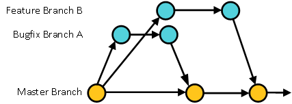

# BOINC Flow
There are many successful approaches to branching with git.  The BOINC community is using the following model that derives heavily from approaches like Microsoft's [Release Flow](https://docs.microsoft.com/en-us/azure/devops/devops-at-microsoft/release-flow) and [GitLab Flow](https://docs.gitlab.com/ee/workflow/gitlab_flow.html) but customizes these approaches to suit the needs of the BOINC community. 

## Master Branch
The master branch is the primary branch in the project.  Committers will never commit to the master branch directly.  Any code merged into master is expected to go through peer review, be unit tested and have had existing automation tests run successfully against the new code before it is merged.  As a result, the master branch is expected to be reliable and is what developers should usually branch from when creating other branches.  

## Feature and Bugfix Branches
Developers create feature or bugfix branches when they want to modify the code base.  If they are a committer, then they can use the [shared repository model](https://gist.github.com/seshness/3943237) and create the branch within the BOINC project directly.  If they are not a committer then they should follow the [fork and pull approach](https://gist.github.com/Chaser324/ce0505fbed06b947d962) to create a branch and submit a pull request.

Features and bugfix branches are merged into master via a pull request.  Developers should understand what is expected before submitting a pull request by reviewing the [Development Workflow](Development_Workflow.md) document.  

Once a feature or bugfix branch has been merged into master it should be deleted.

The majority of the code contributed to the project is developed using a feature or bugfix branch.

<p align="center">

</p>

## Release Branches
BOINC has two types of releases: client releases and server releases.  Each of these require additional integration and end user testing that is not usually done for each individual feature or bugfix branches.  This additional testing needs to be conducted against a stable code base (code freeze) while also allowing development for future work to continue.  The way to do this is to create a release branch.  The release branch freezes the code that is being tested.  Other development can continue on the master branch without impacting the release branch.

A release branch is created off of the master branch.  Since the release branch is considered feature frozen, new code should only be added to the branch if the release manager determines that it is necessary.  

Any code that is added to a release branch after it is created should be a cherry-pick of a merge commit that is present on the master branch.  The merge commit would be the result of a merging a bugfix or feature branch.  See below for the preferred way to create a bugfix branch that is intended for inclusion in a release.

Release branches are never deleted.

<p align="center">

</p>

## Bugfix Branch intended for a Release
Branches for bugfixes that are intended to be included in an existing release branch should be handled carefully in order to minimize the chance of including unrelated code into the release branch.  This can be done by creating the bugfix branch from the same commit where the release branch was created.  In order to do this, you need to identify the commit that served as a base for the release branch and then create the bugfix branch from that commit.

For example, if you were creating a bugfix branch for 7.12 client release you would do the following:
```
[knreed@localhost boinc]$ git merge-base master client_release/7/7.12
aa6e1fac07a7fd826218b2ac16a810a76413dfba
[knreed@localhost boinc]$ git branch knr_fix_issue_1234 aa6e1fac07a7fd826218b2ac16a810a76413dfba
```

This is the recommended and suggested approach whenever possible for handling bugfixes for a release branch.

<p align="center">

</p>

## All Together
As an example of how all of these branches work together, the image below shows master, feature, bugfix and release branches as they might occur in normal development.  

In this example, the release manager was waiting for Feature A to be merged into master so that it could be included in the next release.  Once it was, they created the 7.12 release branch from master and began working leading the community in testing the release.  During the testing a critical bug was uncovered.  A bugfix branch was created off of master to fix the bug and the bugfix branch was merged back into master.  The bugfix was included in the release by cherry-picking the merge commit into the release branch.

While the release was being tested, work on Feature B continued and was merged into master.  That will be included in a future release.

<p align="center">

</p>
